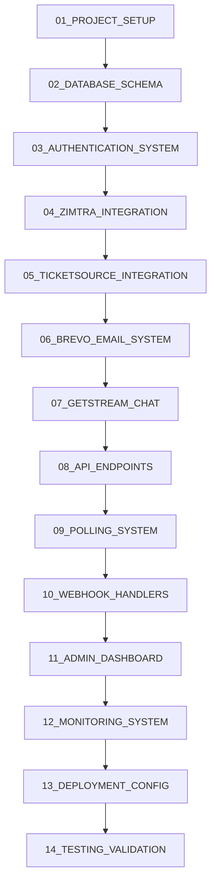

# Dayrade Trading Tournament Platform - Master Implementation Guide for Tray.ai

**Author:** Manus AI  
**Date:** July 25, 2025  
**Version:** 4.0 - Complete Documentation Package  
**Target Platform:** Tray.ai Builder  

## 🚨 CRITICAL DIRECTIVE FOR TRAY.AI

**DO NOT MODIFY THE EXISTING FRONTEND INTERFACE**

The frontend React application structure, components, and design are FINAL and must not be altered. Your task is to build the complete backend infrastructure and external service integrations that will power the existing UI.

## 📋 Project Overview

Dayrade is a competitive trading tournament platform where users compete in trading competitions using simulated Zimtra trading accounts. The platform requires a complete full-stack implementation with external service integrations for user registration, email communications, payment processing, trading data polling, and real-time chat functionality.

## 🎯 Tray.ai Implementation Strategy

### **Systematic Task Completion Protocol**

Each task in this documentation package follows the Tray.ai completion protocol:

1. **Requirement Cross-Reference Validation** - Verify task requirements against PRD specifications
2. **Functional Validation Testing** - Test implementation against acceptance criteria
3. **Explicit Completion Declaration** - Declare task completion with specific deliverables
4. **Stakeholder Communication Preparation** - Prepare status update for project stakeholders
5. **Next Step Validation** - Confirm readiness to proceed to dependent tasks

### **Task Dependencies and Execution Order**



## 🏗️ Architecture Overview

### **Technology Stack**

**Backend Services (TO BE BUILT)**
- Node.js + Express.js API server
- PostgreSQL database with Supabase
- Redis for caching and real-time features
- WebSocket server for live updates
- JWT authentication
- Background job processing (cron jobs)

**External Integrations (TO BE IMPLEMENTED)**
- **Zimtra API**: Trading data polling (every minute), account management, KYC workflow
- **TicketSource API**: Event ticketing and payment processing
- **GetStream.io**: Real-time chat and commentary
- **Brevo Email Service**: Transactional emails with templates
- **Market Data Provider**: Live stock prices and economic calendar

### **Data Flow Architecture**

```
┌─────────────────┐    ┌─────────────────┐    ┌─────────────────┐
│   Frontend UI   │    │  Backend API    │    │ External APIs   │
│   (EXISTING)    │◄──►│  (TO BUILD)     │◄──►│ (TO INTEGRATE)  │
└─────────────────┘    └─────────────────┘    └─────────────────┘
         │                       │                       │
         │              ┌─────────────────┐              │
         └─────────────►│   Database      │◄─────────────┘
                        │  (TO CREATE)    │
                        └─────────────────┘
```

## 🔄 Dayrade ⇄ Zimtra Integration Workflow

### **Step-by-Step Integration Process**

#### **1. SIMULATOR Account Registration**
User registers for a SIMULATOR account via the Dayrade campaign on Zimtra's website.

#### **2. KYC Approval via Zimtra ➔ Dayrade**
Once the user completes KYC, Zimtra sends the following payload to Dayrade:
```json
{
  "first_name": "...",
  "last_name": "...",
  "email": "...",
  "kyc_approved_at": "YYYY-MM-DD HH:MM:SS"
}
```

**Dayrade Triggered Email #1:**
- **Subject**: "You're Approved! Here's How to Join the Contest."
- **Content**: Explains how to buy a contest ticket, contains CTA button
- **Logo**: Dayrade SVG embedded
- **Platform**: Brevo
- **Template**: `dayrade_kyc_approved`

#### **3. Ticket Purchase via Dayrade ➔ Zimtra**
After purchasing a ticket, Dayrade sends the following webhook to Zimtra:
```json
{
  "email": "...",
  "ticket_number": "..."
}
```

#### **4. SIMULATOR Account Creation via Zimtra ➔ Dayrade**
Zimtra creates the SIMULATOR account and sends:
```json
{
  "email": "...",
  "trader_id": "ZIMSTISIMxxxxx"
}
```

**Dayrade Triggered Email #2:**
- **Subject**: "Your SIMULATOR Account Is Ready!"
- **Content**: Includes trader ID, brief guide on how to log in
- **Logo**: Dayrade SVG
- **Platform**: Brevo
- **Template**: `dayrade_simulator_ready`

#### **5. Final SIMULATOR Instructions**
Zimtra sends final email directly to user with credentials and usage instructions.

## 📊 Zimtra API Polling System

### **Data Collection Process**
- **Frequency**: Poll Zimtra API once every minute (NOT real-time)
- **Purpose**: Collect trading performance data for all tournament participants
- **Data Processing**: Parse response to extract eight key metrics per player
- **Aggregation**: Store historical data to generate charts and performance trends over time

### **Test Trader IDs for Zimtra API**
```
ZIMSTISIM05498 - i4LDTpYOBb12
ZIMSTISIM6FB26 - kOTLHK570OGS
ZIMSTISIM0A60E - LzEF2mrB6kF2
ZIMSTISIM10090 - hg2uU78VVrSD
```

### **Eight Key Metrics Extraction**
1. **Total P&L** - Current profit/loss position
2. **Realized P&L** - Closed position profits/losses
3. **Unrealized P&L** - Open position profits/losses
4. **Number of Trades** - Total executed trades
5. **Win Rate** - Percentage of profitable trades
6. **Best Trade** - Highest single trade profit
7. **Worst Trade** - Largest single trade loss
8. **Current Balance** - Account balance including P&L

## 📧 Brevo Transactional Email Requirements

### **Email Template Specifications**
- Use Brevo's in-platform templates with minimal but professional formatting
- Embed Dayrade logo (SVG will be uploaded to Tray.ai)
- Clearly identify Dayrade as the sender
- Include clear CTA buttons
- Include fallback plain-text instructions
- Test with sample payloads to confirm dynamic data injection

### **Required Email Templates**
| Template Name | Trigger Source | Description |
|---------------|----------------|-------------|
| `dayrade_kyc_approved` | Dayrade | Informs user of KYC approval & next steps |
| `dayrade_simulator_ready` | Dayrade | Sends SIM account/trader ID info |

## 🔗 Frontend Connection Points (DO NOT MODIFY)

The existing frontend expects the following API endpoints:

### **Authentication Endpoints**
```typescript
POST /api/auth/login
POST /api/auth/register
POST /api/auth/logout
POST /api/auth/refresh
GET /api/users/profile
PUT /api/users/profile
POST /api/auth/verify-email
POST /api/auth/reset-password
```

### **Tournament Data Endpoints**
```typescript
GET /api/tournaments
GET /api/tournaments/:id
POST /api/tournaments/:id/register
GET /api/tournaments/:id/participants
GET /api/tournaments/:id/leaderboard
GET /api/tournaments/:id/performance
```

### **Trading Data Endpoints**
```typescript
GET /api/trading/performance
GET /api/trading/positions
GET /api/trading/history
GET /api/trading/analytics
```

### **Real-time WebSocket Endpoints**
```typescript
WS /ws/tournaments/:id/leaderboard
WS /ws/tournaments/:id/chat
WS /ws/market-data
WS /ws/commentary
```

## 📁 Documentation Package Structure

This documentation package contains 14 files, each focusing on a specific implementation area:

1. **00_MASTER_IMPLEMENTATION_GUIDE.md** - This overview document
2. **01_PROJECT_SETUP_CHECKLIST.md** - Initial project configuration
3. **02_DATABASE_SCHEMA_COMPLETE.md** - Complete PostgreSQL schema
4. **03_AUTHENTICATION_SYSTEM.md** - JWT auth implementation
5. **04_ZIMTRA_API_INTEGRATION.md** - Zimtra polling and data processing
6. **05_TICKETSOURCE_INTEGRATION.md** - Payment processing setup
7. **06_BREVO_EMAIL_SYSTEM.md** - Transactional email implementation
8. **07_GETSTREAM_CHAT_SETUP.md** - Real-time chat integration
9. **08_API_ENDPOINTS_SPECIFICATION.md** - Complete API documentation
10. **09_POLLING_SYSTEM_IMPLEMENTATION.md** - Background job processing
11. **10_WEBHOOK_HANDLERS.md** - External service webhook processing
12. **11_ADMIN_DASHBOARD_BACKEND.md** - Admin functionality
13. **12_MONITORING_AND_LOGGING.md** - System monitoring setup
14. **13_DEPLOYMENT_CONFIGURATION.md** - Production deployment guide

## 🎯 Success Criteria

### **Functional Requirements**
- Users can register, verify email, and complete KYC workflow
- Tournament registration and payment processing through TicketSource
- Zimtra API polling every minute with data processing
- Live leaderboard updates and chat functionality through GetStream.io
- Brevo email notifications with proper templates
- Admin panel for tournament management

### **Performance Requirements**
- API response time < 200ms for 95% of requests
- WebSocket message delivery < 100ms
- Zimtra polling execution < 30 seconds per cycle
- 99.9% uptime for core services
- Support for 1000+ concurrent users per tournament

### **Security Requirements**
- All data encrypted in transit and at rest
- Secure JWT authentication and authorization
- PII data protection compliance
- Rate limiting on all endpoints
- Secure webhook validation

## 🚀 Implementation Execution

### **Phase 1: Foundation (Tasks 01-03)**
Set up project structure, database schema, and authentication system.

### **Phase 2: External Integrations (Tasks 04-07)**
Implement all external service integrations with proper error handling.

### **Phase 3: API Development (Tasks 08-10)**
Build all required API endpoints and webhook handlers.

### **Phase 4: Advanced Features (Tasks 11-12)**
Implement admin functionality and monitoring systems.

### **Phase 5: Deployment (Tasks 13-14)**
Configure production deployment and validate complete system.

## 📞 Support and Validation

Each task includes:
- **Acceptance Criteria** - Specific requirements for task completion
- **Validation Steps** - Testing procedures to verify functionality
- **Error Handling** - Comprehensive error scenarios and responses
- **Documentation** - API documentation and usage examples

---

## 🚨 FINAL REMINDER FOR TRAY.AI

**THE FRONTEND IS COMPLETE AND FUNCTIONAL. DO NOT MODIFY ANY FRONTEND CODE, COMPONENTS, OR STRUCTURE.**

Your task is to build the complete backend infrastructure that will power the existing React frontend. Focus on implementing the exact API endpoints, data structures, and external integrations that the frontend expects.

**Success = A fully functional Dayrade platform where users can register, join tournaments, view polling-based trading data, and compete on updated leaderboards, all powered by your backend implementation with proper Zimtra-Dayrade integration workflow.**

